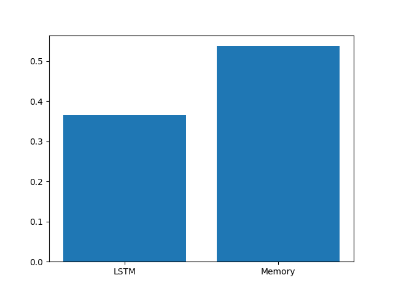
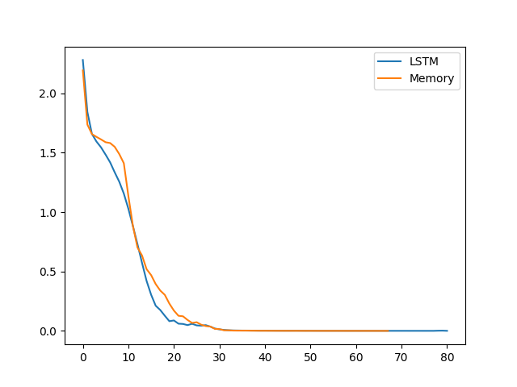

# 🧠 MASSA: Memory-Augmented Sequence Modeling


---

## 📌 Overview

This project investigates the limitations of traditional sequence models and demonstrates how **memory-augmented architectures improve learning of long-range dependencies**.

Standard LSTM models compress sequence information into fixed hidden states, often leading to information loss.
This implementation introduces a **Memory-Augmented Model with attention**, enabling selective focus on important sequence elements.

---

## 🎯 Objective

* Compare **LSTM vs Memory-Augmented Model**
* Evaluate **long-term dependency learning**
* Demonstrate the effectiveness of **attention mechanisms**
* Build a minimal, interpretable **research prototype**

---

## 🧪 Problem Formulation

### Input

```text
[3, 8, 1, 5, 9, ...]
```

### Target

```text
(first_element + last_element) % 10
```

This task enforces:

* retention of **early sequence information**
* awareness of **late sequence elements**
* combination of both → requiring **memory + reasoning**

---

## 🏗️ Architecture

### 🔹 LSTM Model

* Embedding + Positional Encoding
* Multi-layer LSTM
* Mean pooling over sequence
* Fully connected output

### 🔹 Memory-Augmented Model

* Embedding + Positional Encoding
* Multi-layer LSTM backbone
* Attention mechanism for dynamic weighting
* Context vector aggregation
* Fully connected output

---

## 🛠️ Tech Stack

* **Python 3.10+**
* **PyTorch** – model design & training
* **NumPy** – synthetic data generation
* **Matplotlib** – visualization
* **Scikit-learn** – dataset splitting

---

## 📦 Installation

```bash
git clone https://github.com/dusssi/massa-memory-model.git
cd massa-memory-model

python -m venv .venv
.venv\Scripts\activate   # Windows

pip install -r requirements.txt
```

---

## ▶️ Usage

```bash
python main.py
```

---

## 📊 Results

### 🔹 Accuracy Comparison



### 🔹 Training Loss



---

## 📈 Performance

| Model        | Accuracy |
| ------------ | -------- |
| LSTM         | 0.36     |
| Memory Model | 0.53     |

---

## 🧠 Key Insight

> Sequence compression (LSTM) is insufficient for tasks requiring selective recall.
> Attention-based memory enables models to retain and prioritize relevant information.

---

## 🔬 Analysis

* LSTM struggles with **information dilution**
* Memory model improves **feature relevance**
* Attention acts as a **soft retrieval mechanism**

---

## 🚀 Future Work

* Transformer-based comparison
* Real-world datasets (NLP, time-series)
* Advanced memory modules
* Hyperparameter optimization

---

## 📄 Research Context

Inspired by:

* Memory-Augmented Neural Networks
* State Space Models (e.g., Mamba)
* Attention-based architectures

---

## 👤 Author

**Dushyant**
MCA (AI & ML)
SGT University

---

## 📌 Notes

This project is designed for **conceptual understanding and comparative analysis**, not production deployment.

---
